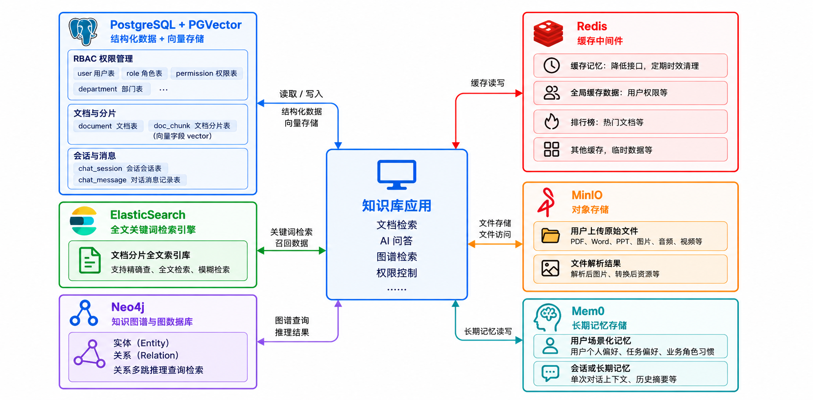
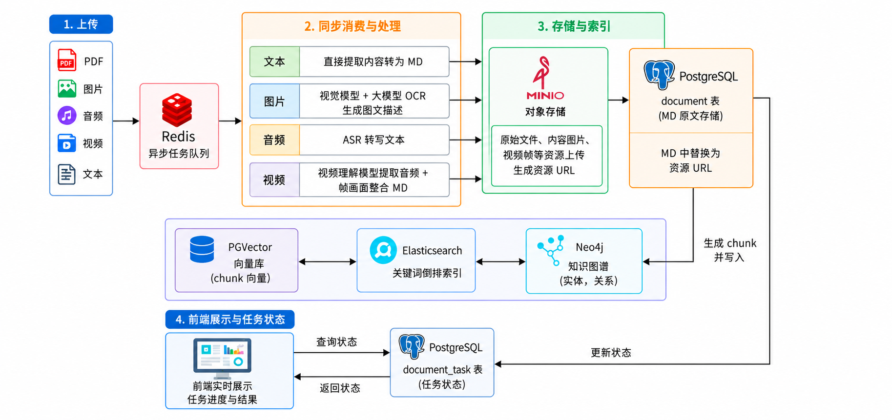
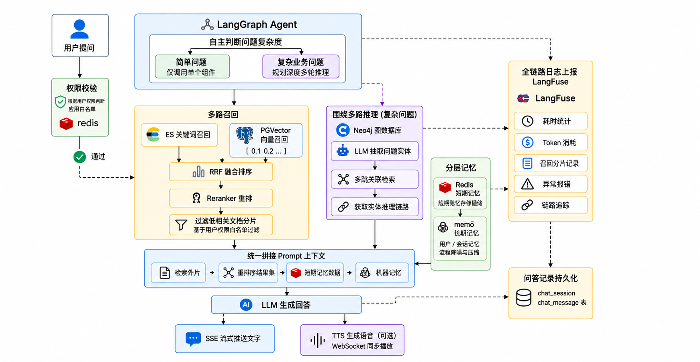

# Agentic RAG 项目概览

## 项目定位

Ernest Bot Agent 面向企业内部知识分散、跨部门资料缺少统一入口、传统检索召回不足等问题，
目标是建设一套具备文档管理、权限感知检索、Agentic RAG 问答、知识图谱和多模态处理能力的
企业知识平台。

当前仓库仍处于**工程基础与技术选型阶段**。下文把“仓库已经具备的能力”和“产品蓝图”分开
描述；蓝图中的技术名称不表示已经完成实现或最终选型。

## 当前仓库状态

| 范围                      | 当前状态                                                                             | 证据入口                                                       |
| ------------------------- | ------------------------------------------------------------------------------------ | -------------------------------------------------------------- |
| pnpm + Turborepo monorepo | 已建立 2 个 Next.js 应用、2 个 NestJS 服务和共享包                                   | [仓库 README](../../README.md)                                 |
| Web 与业务 API 边界       | 已完成稳定 oRPC v1 greeting PoC，并接入 TanStack Query                               | [oRPC 指南](./orpc.md)                                         |
| 运行时契约                | 已使用 Zod 契约在前后端共享运行时校验与类型                                          | [`packages/contracts`](../../packages/contracts)               |
| MCP 服务                  | 已建立独立 NestJS 应用；业务 Tools、Resources 和 Widget 仍待实现                     | [`apps/mcp-app-collections`](../../apps/mcp-app-collections)   |
| 健康检查                  | 业务服务已有 `live`、`ready`、`whoami` 边界                                          | [`health`](../../apps/agentic-rag-business-service/src/health) |
| 部署拓扑                  | 已选定 Vercel Web + Railway API/Consumer/Cron 的目标拓扑，尚未完成资源创建和部署验证 | [部署指南](./deployment-and-infrastructure.md)                 |
| RAG 业务能力              | 文档入库、检索、问答、权限和图谱等仍是待实施蓝图                                     | 本文“产品能力蓝图”                                             |

## 产品能力蓝图

### 知识管理与权限

- 统一导入、解析、切分、向量化和管理企业文档，并保留版本与处理状态。
- 使用 RBAC 管理页面、菜单、操作和数据访问；检索阶段按用户权限过滤可访问知识。
- AI 回答只组合用户有权访问的文档、图谱和记忆信息，并提供来源线索。

### 多模态知识入库

目标输入包括：

- 文本与结构化文档：PDF、DOCX/DOC、XLSX/XLS、PPTX/PPT、TXT、MD、CSV、JSON。
- 网页 URL：抓取正文后进入统一解析、切分和索引流程。
- 图片：提取视觉特征，并通过 OCR/视觉理解生成可检索描述。
- 音频：通过 ASR 转写为文本后归档和检索。
- 视频：组合音轨转写、关键帧/画面理解和文本抽取，形成可检索内容。

这些格式来自产品输入材料，**当前仓库尚未实现或验证上述格式支持**。

### Agentic RAG 问答

目标问答链路由 Agent 判断问题复杂度，再按需组合以下能力：

1. 向量与关键词多路召回。
2. RRF 融合、Reranker 重排和权限过滤。
3. 对复杂问题执行实体抽取、图谱多跳检索和推理链路组织。
4. 合并检索片段、图谱结果、短期记忆和长期记忆，构造统一上下文。
5. 通过 SSE 输出文字；语音场景可扩展为 ASR、流式 TTS 和 WebSocket 播放。
6. 记录耗时、Token、召回来源、异常和回答结果，用于评测与优化。

### 数据与基础设施职责

产品输入材料给出了 PostgreSQL/PGVector、Elasticsearch、Neo4j、MinIO、Redis 和 Mem0 的组合。
它们在本项目中的状态需要严格区分：

| 职责                                     | 当前项目结论                                                                      |
| ---------------------------------------- | --------------------------------------------------------------------------------- |
| 业务事实、文档元数据、任务状态、会话记录 | 由数据库持久化；具体数据库产品尚未最终确定                                        |
| 原始文档和解析产物                       | 由对象存储持久化；MinIO 只是输入材料中的候选示意                                  |
| 向量和索引                               | 由向量存储承担；PGVector/Elasticsearch 尚未接受为最终选型                         |
| 知识图谱                                 | Neo4j 是输入材料中的目标方案，尚未形成项目 ADR 或实现                             |
| 缓存、锁、限流和短期状态                 | Redis 已接受；不得作为业务事实或可靠任务队列                                      |
| 异步命令与事件                           | RabbitMQ 已接受，使用持久消息、publisher confirm、manual ack、重试/DLQ 和幂等处理 |
| 长期记忆                                 | Mem0 是输入材料中的目标方案，尚未形成项目 ADR 或实现                              |
| 观测与评测                               | LangSmith/LangFuse 是候选工具，尚未形成最终选型或运行验证                         |

## 目标流程

### 文档入库

```text
上传或 URL 导入
  -> API 写入任务与原始文件引用
  -> RabbitMQ 发布可幂等的处理命令
  -> 常驻 Consumer 解析文本 / 图片 / 音频 / 视频
  -> 保存解析产物与文档元数据
  -> 建立关键词、向量和图谱索引
  -> 更新任务状态，前端查询进度与结果
```

这里使用 RabbitMQ 替代输入材料中的“Redis 异步任务队列”，以保持与项目 ADR-0007、ADR-0008
一致。Consumer 只有在持久化副作用完成后才确认消息，Redis 不承担可靠投递职责。

### 权限感知问答

```text
用户提问
  -> 身份与权限校验
  -> Agent 判断问题复杂度
  -> 关键词 / 向量 / 图谱按需检索
  -> RRF 融合、重排、数据权限过滤
  -> 合并检索证据与分层记忆
  -> LLM 生成回答并流式输出
  -> 持久化会话、来源和观测数据
```

## 输入蓝图图片

以下图片是根据用户提供的低清截图进行的 AI 清晰化重建，用于保存需求语义，不代表当前实现。
生成过程可能改变细小字体或图标，技术事实应以本文、源码和 ADR 为准。

### 数据与存储构想



### 多模态入库构想



### Agent 问答构想



## 后续落地边界

每个涉及框架、协议、数据库或跨应用依赖方向的能力，都需要先通过 OpenSpec 描述具体变更，
同步更新架构文档，并新增或替代相应 ADR。实现完成前，不把蓝图中的产品或流程写成仓库现状。
